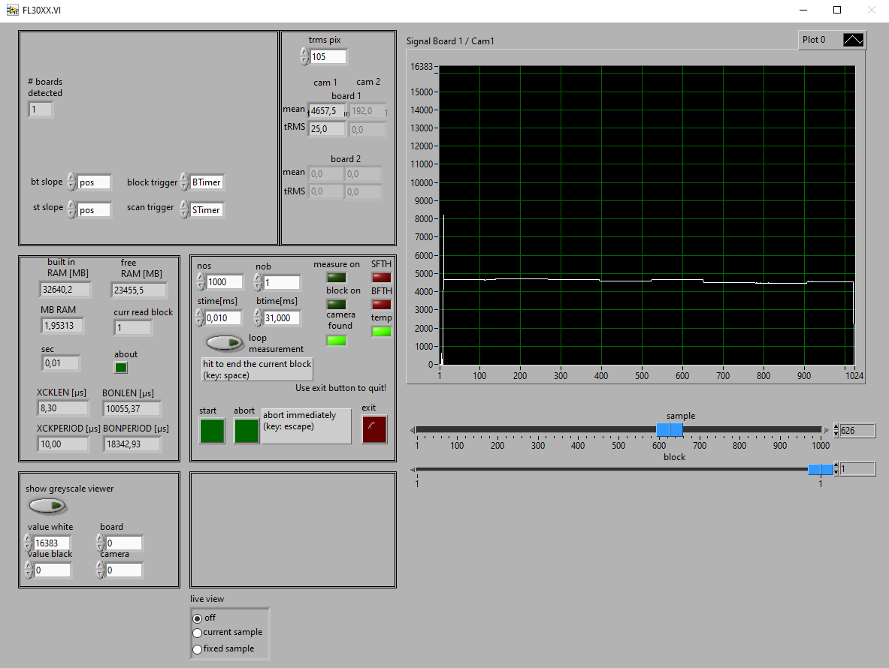

# Labview examples for Stresing Cameras

This repository contains example programs for operating [Stresing](https://stresing.de/) cameras with [LabVIEW](https://www.ni.com/en-us/shop/labview.html).

file				| description
:---				| :---
abouttest.vi		| Basic test program, to test the driver and the PCIe board
config.vi			| Contains all settings to configure the correct camera system
FL30XX.vi			| More complex program with event structures
FL30XX_simple.vi	| Simple program to visualize the basic operating flow

## FL30XX.vi

## Dependencies 

- For the use of `ESLSCDLL.dll` [Microsoft Visual C++ Redistributable](https://aka.ms/vs/16/release/vc_redist.x64.exe) must be installed.
- LabVIEW 15 or newer, 64 bit version

## How to operate the cameras
All parameters in `config.vi` must be set according to your camera system. The camera can perform a specific number of samples in a block-wise fashion. The number of samples per block (nos) and the number of total blocks (nob) are defined in the lower left box of the control front panel. The data is written to the RAM, so the maximum of samples and blocks are limited by your installed RAM.

A single run can be started by clicking the "start" button in the lower right box of the panel. A single run cycles through all the blocks and performs as many samples per block as previously being specified. The exposure time can be modified in the STIME box or if external trigger is used, be sure not to exceed the max. frequency.

The measurement can also be done continuously after activating the loop measurement switch in the same box. Looping the measurement can be stopped by pressing the loop button or the space key while running. All samples and all blocks are then finished for the current loop. If you want to abort the measurement immediately, press the abort button or the ESC key. In memory the old values from the scans before are still there.

After finishing a measurement the blocks and scans can be examined by moving the sliders. To terminate the program you must use the exit button, in order to stop the cam control program and its multi threaded background processes properly. Only exit the program, when no measurement is running. If a measurement is running and you want to exit, stop it like described above. If you use the LabVIEWs exit, the driver will not be closed properly! That will lead to additional error messages.

## Basic flow of a measurement
1. Load settings with `config.vi`
2. Initialize the driver with `InitDriver.vi`
3. Initialize the PCIe board with `InitBoard.vi`
4. Initialize the software and the camera for the next measurement with `InitMeasurement.vi`
5. Start the measurement with `StartMeasurement.vi` or with `StartMeasurement_blocking.vi` for a blocking call. The blocking call will return after the complete measurement is done. `StartMeasurement.vi` will start the measurement in a new thread and will return immediately.
6. Get the data with `ReturnFrame.vi` for one frame, `CopyOneBlock.vi` for one block or `CopyAllData.vi` for the complete data.
7. Before exiting the program, call `ExitDriver.vi`
